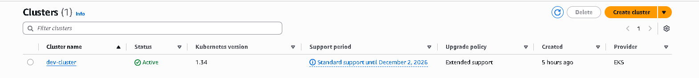
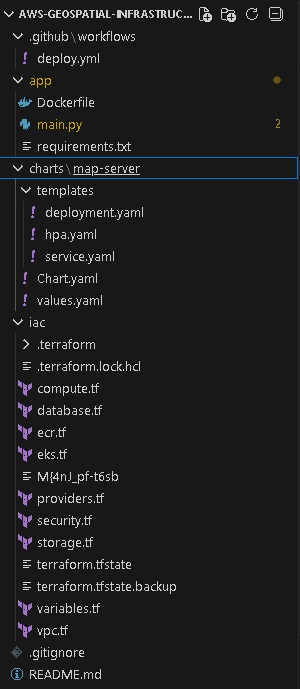
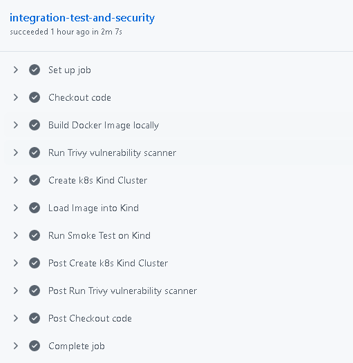
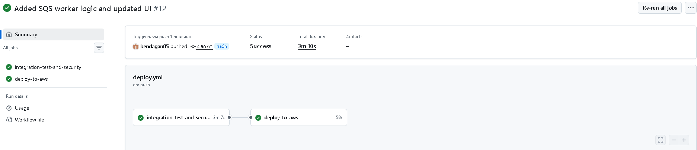
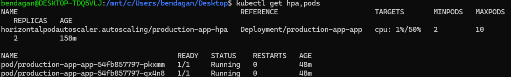
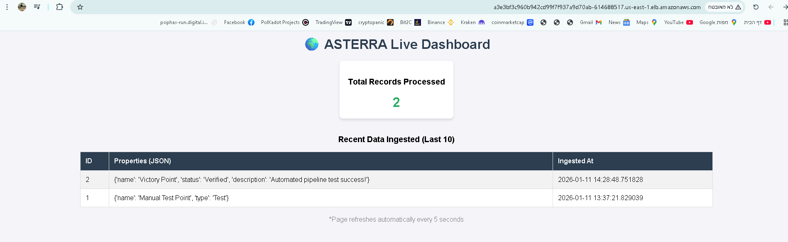

# 🌍 Geo-SRE: Cloud-Native Geospatial Data Pipeline


## 📖 Project Overview

**Geo-SRE** is a production-grade, event-driven DevOps project designed to ingest, validate, and visualize geospatial data automatically.

Unlike standard web apps, this project focuses on **Infrastructure reliability, Security, and Automation**. It features a "Zero-Touch" workflow where data uploaded to S3 triggers a complex chain of events, processed securely inside a private Kubernetes network, and visualized in real-time.

---

## 🏗️ Architecture & Infrastructure

The entire environment is provisioned via **Terraform** (IaC) and follows strict security best practices (Private Subnets, Least Privilege IAM Roles).

### High-Level Data Flow
1.  **Ingest:** User uploads `GeoJSON` to a Private S3 Bucket.
2.  **Event:** S3 Notification triggers an SQS Queue message.
3.  **Process:** Python Worker (running on EKS) consumes the message, parses the geometry.
4.  **Storage:** Data is written to AWS RDS (PostgreSQL + PostGIS).
5.  **Visualization:** Flask App serves live data via Load Balancer.

### Infrastructure (AWS EKS)
*The active Kubernetes cluster provisioned by Terraform:*



### 📂 Project Structure
*Organized for maintainability using Helm Charts for Kubernetes and modular Terraform.*



---

## ⚖️ Design Decisions

- SQS + EKS Workers were chosen over AWS Lambda to allow better control over scaling and retries.
- This architecture enables realistic end-to-end testing using Kind during CI, closely matching the production environment.

---

## 🛡️ Robust CI/CD Pipeline (DevSecOps)

The pipeline is designed with a **"Shift-Left"** security approach. No code reaches production without passing strict automated gates inside GitHub Actions.

### Pipeline Highlights:
1.  **Security Scanning (Trivy):** Scans the container image for CVEs (Critical/High) before building.
2.  **Ephemeral Integration Testing (Kind):** Spins up a real **Kubernetes in Docker (Kind)** cluster inside the CI runner.
3.  **Smoke Tests:** Deploys a temporary Postgres DB and the App to verify connectivity and stability *before* touching the cloud.




---

## 🚀 Kubernetes Scaling & Reliability

The application runs on **Amazon EKS** and is configured for high availability.

### Horizontal Pod Autoscaler (HPA)
The system automatically scales the number of pods based on CPU utilization. If the data processing load increases, Kubernetes spins up more workers instantly.

**Proof of Autoscaling Configuration:**


---

## 🛠️ Tech Stack

| Category | Technology | Usage |
|----------|------------|-------|
| **Cloud** | AWS | EKS, RDS, S3, SQS, VPC, IAM |
| **IaC** | Terraform | Full environment provisioning with Remote State (S3) |
| **Orchestration** | Kubernetes | Helm Charts, HPA, Deployments, Services |
| **CI/CD** | GitHub Actions | Automation, Trivy Security, Kind Integration Tests |
| **Database** | PostgreSQL | With PostGIS extension for spatial queries |
| **Backend** | Python (Flask) | REST API & SQS Worker |

---

## 📸 End-to-End Demo

### The Result: Live Dashboard
After uploading a GeoJSON file to S3, the pipeline processes it automatically, and the dashboard updates in real-time with the new data points.




## 💻 How to Run

1.  **Clone the Repo:**
    ```bash
    git clone [https://github.com/your-repo/geo-sre.git](https://github.com/your-repo/geo-sre.git)
    ```
2.  **Infrastructure Up:**
    ```bash
    cd iac
    terraform init && terraform apply
    ```
3.  **Deploy (Automatic):**
    Pushing to `main` triggers the pipeline, runs tests, and deploys to EKS.


